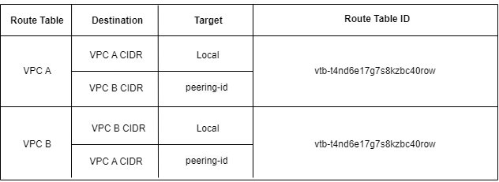
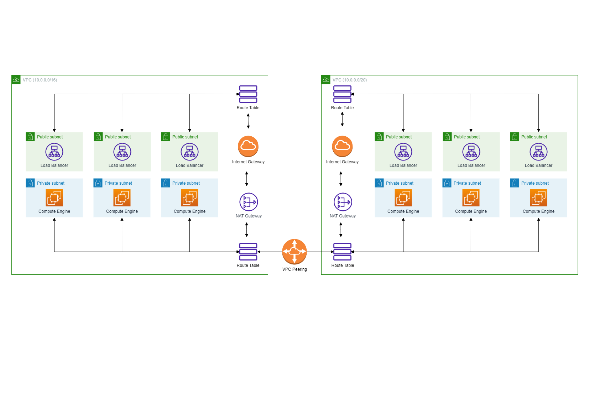
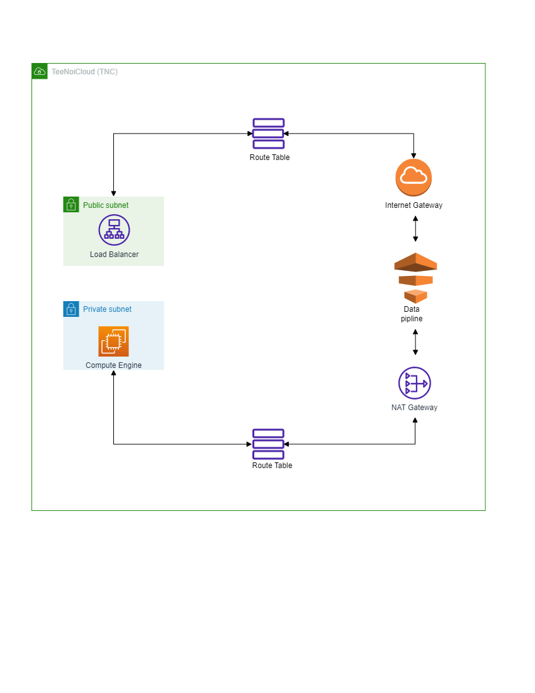

# ***Example***

## 1. กำหนดให้ VPC มี CIDR range 10.0.0.0/8 จงออกแบบ subnet(vswitch) ตามรายละเอียดดังนี้

>### 1.1 public 6 zone พร้อมระบุจำนวน ip ที่ใช้ได้
= 6291456

>### 1.2 private: 6 zone พร้อมระบุจำนวน ip ที่ใช้ได้
= 6291456

>### 1.3 ระบุจำนวน ip ที่ยังเหลือ
= 4,194,304

เงื่อนไข: ให้เหลือจำนวน Available IPs น้อยที่สุด
__________________

## 2. กำหนดให้ VPC มี CIDR range 172.31.0.0/16 จงออกแบบ subnet(vswitch) ตามรายละเอียดดังนี้

>### public 4 zone พร้อมระบุจำนวน ip ที่ใช้ได้
= 32768

>### private: 4 zone พร้อมระบุจำนวน ip ที่ใช้ได้
= 32768

>### ระบุจำนวน ip ที่ยังเหลือ
= 0

เงื่อนไข: ให้เหลือจำนวน Available IPs น้อยที่สุด
___________________
## 3. จากคำตอบข้อ 1 และ 2 ให้ตอบคำถามย่อยต่อไปนี้

>### 3.1 ต้องใช้ Service อะไรที่ทำให้ VPC จากข้อที่ 1 และ 2 สามารถรับส่งข้อมูลถึงกันได้
= Load Balancer , VPC peering  

>### 3.2 จงวาดตาราง Route Table พร้อมระบุการ ค่าให้เรียบร้อย
= 

___________________
## 4. (optional) ให้ออกแบบระบบซื้อขายออนไลน์โดยมีองค์ประกอบดังนี้

>### 4.1 สินค้า(product), ตะกร้าสินค้า(cart) ,จ่ายเงิน(payment) ,การขนส่งสินค้า(Shipping) ,ผู้ใช้(User)
= 

>### 4.2 Database,Service
= 

>### 4.3 สามารถรองรับผู้ใช้งานได้จำนวณมหาศาล (แบบง่าย)
= 
___________________
## 5. กำหนดให้ VPC A มี CIDR (10.0.0.0/16) และ VPC B มี CIDR (10.0.0.0/20) จงตอบคำถามต่อไปนี้

>### 5.1 VPC A แลพ VPC B สามารถ peering กันได้หรือไม้ หากไม่ได้จงบอกเหตุผล
= ไม่สามารถ peering กันได้ เพราะมีเลข Subnetmark ที่ทับกันทั้งสองเลขทำให้ไม่สามารถเเยกออกได้ว่าเป็นอันไหน
_______
>### 5.2 กรณีที่สามารถ Peering ได้ จะต้องทำอย่างไรให้ Service ที่อยู่ภายใน VPC ทั้งสองสามารถติดต่อสื่อสารกันได้
= ต้องทำการเปลี่ยนเลข Subnetmark ให้อยู่ช่วงอื่น เช่น 
##### VPC A CIDR(10.0.0.0/16)
##### VPC B CIDR(10.0.0.16/20)
_______
>### 5.3 ให้วาดรูป architechture ประกอบ
=
_______
>### 5.4 (optional) ใส่ component อื่นๆ ให้ครบ  เช่น LB, Compute Engine,NatGW
= 

___________________
## 6. Hypervisor มีกี่ประเภทแต่ละประเภทคืออะไรบ้าง แล้วประเภทไหนที่ Computer ของเราใช้งานในการเปิด emulator (ตอบตามความเข้าใจ!!!)
= เป็นการทำให้คอมพิวเตอร์สามารถเเบ่งบัน การใช้ทรัพยากรด้าน Hardware เดียวกันได้ เเบ่งเป็น 2 ประเภท
type 1 (Baremetal Architecture) 
type 2 (Hosted Architecture)
การที่จะสามารถใช้ emulator ได้จะต้องใช้ Type 2 ที่สามารถรองรับ และ จัดการการจำลองเสมือน โดยการทำงานจะต้องผ่านระบบปฏิบัติการก่อนในการจำลองเสมือน   
___________________
## 7.(optional)ให้ออกเเบบ architechture ที่นำ application ของเรามาเชื่อมต่อกับ cloud (ไม่ผิดไม่ถูกเน้นหน้าตาการออกเเบบขึ้นที่ไปอยู่บน Cloud เอง)
= 
___________________
## 8.ให้ตอบคำถามต่อไปนี้เกี่ยวกับ Debian
>### 8.1 Debian คืออะไร
= เป็นระบบปฏิบัติการที่พัฒนามาจาก Open Source ของ Linux พัฒนาเพื่อให้สามารถรองรับได้บนหลากหลายอุปกรณ์ Hardware
>### 8.2 version stable ล่าสุดมีชื่อเล่นว่าอะไร
= bullseye
>### 8.3 Package Manager ต้องใช้คำสั่งว่าอะไร
= apt
>### 8.4 หากต้องการติดตั้ง git ต้องใช้คำสั่งว่าอะไร
= sudo apt install git
___________________
## 9.ให้ตอบคำถามต่อไปนี้เกี่ยวกับ Alpine
>### 9.1 Alpine คืออะไร
= เป็นระบบปฏิบัติการที่พัฒนามาจาก Open Source ของ Linux ที่เน้นใช้งานในด้าน Network 
>### 9.2 version stable ล่าสุดมีชื่อเล่นว่าอะไร
= BusyBox version 3.17 (22 Nov 2022)
>### 9.3 Package Manager ต้องใช้คำสั่งว่าอะไร
= apk
>### 9.4 หากต้องการติดตั้ง git ต้องใช้คำสั่งว่าอะไร
= apk add git
___________________
## 10.ให้ตอบคำถามต่อไปนี้เกี่ยวกับ Amazonlinux
>### 10.1 Amazonlinux คืออะไร
= เป็นระบบปฏิบัติการ Linux ที่พัฒนาโดย Amazon Web Services (AWS) จะเน้นการรักษาความปลอดภัย เเละ เสถียร เพื่อรองรับการทำงานบน Cloud
>### 10.2 version stable ล่าสุดมีชื่อเล่นว่าอะไร
= version 2.0.20230207.0
>### 10.3 Package Manager ต้องใช้คำสั่งว่าอะไร
= yum
>### 10.4 หากต้องการติดตั้ง git ต้องใช้คำสั่งว่าอะไร
= sudo yum install git (รันอยู่บน Amazon Linux 1)
___________________
## 11. หากเราต้องการสร้างบริษัทเป็นผู้ให้บริการ Cloud จงตอบคำถามต่อไปนี้
>### 11.1 เราควรมีอุปกรณ์ Hardware อะไรบ้าง พร้อมอธิบาย
= Load Balancer ,  Computer Engine Cloud , อุปกรณ์กรณ์เชื่อมต่อ Network 
>### 11.2 เราควรมี Software อะไรบ้าง พร้อมอธิบาย
= AWS
เอาไว้จัดการข้อมูลต่างๆเช่น  service,พื้นที่การใช้งาน,ระบบฐานข้อมูล
>### 11.3 วาดภาพ Architechture ของ Cloud Service ของเรา
= 
>### 11.4 ชื่อ Cloud ที่เราให้บริการมีชื่อว่าอะไร
= TeeNoiCloud (TNC)
>### 11.5 Cloud ของเรามี Server อะไร ที่ให้บริการผู้ใช้งานได้บ้าง
= vmware,aws,azure
___________________
