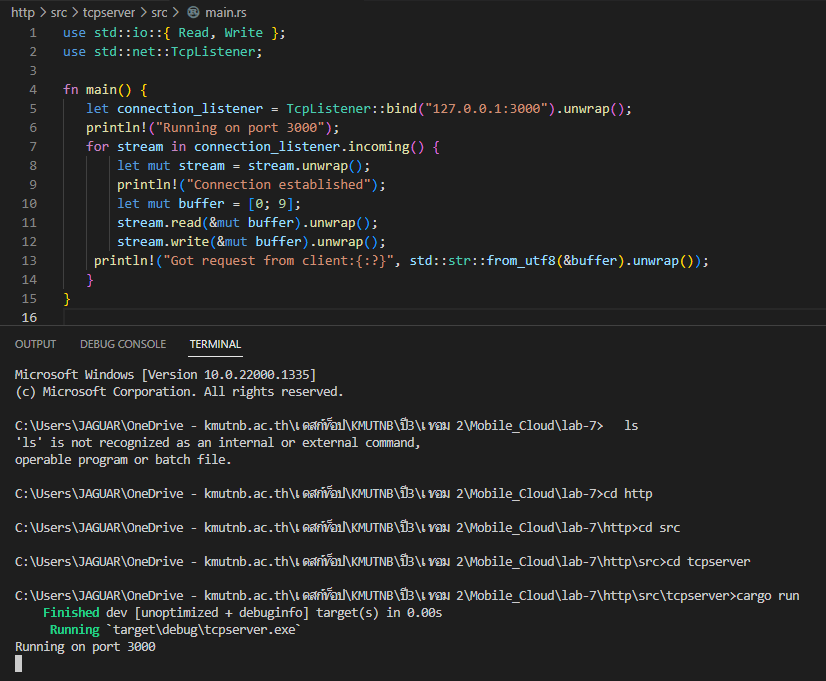
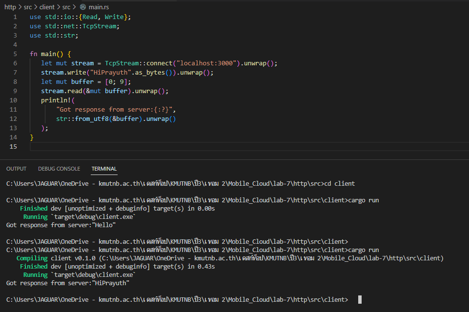
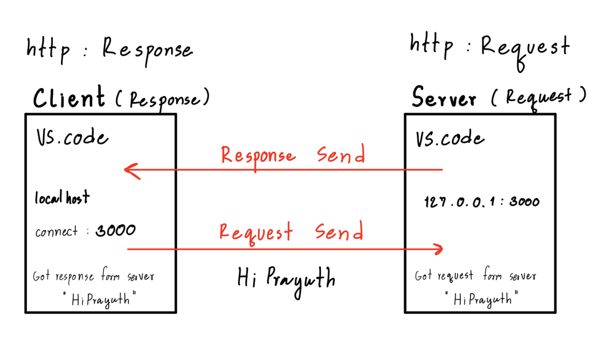

# ***Example***

## 1. ให้ Design httpRequest พร้อมเขียน code และ รันเเสดงผลลัพธ์

= 
_____________________________

>### 2. ให้ Design httpResponse พร้อมเขียน code และ รันเเสดงผลลัพธ์
= 
_____________________________

 
